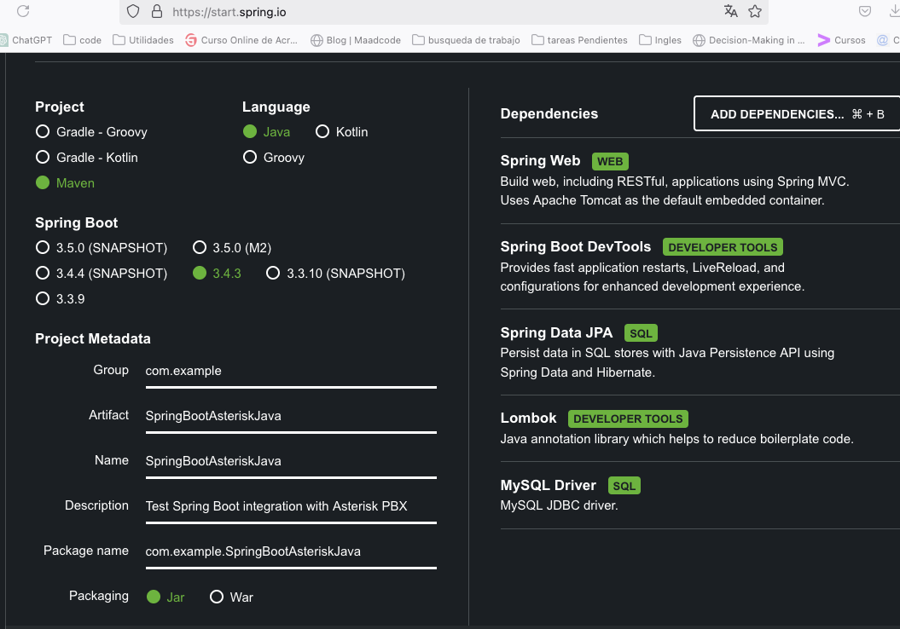

# Description
Basic general API to get information from an Asterisk and manage the flow of calls.

# STEPs for RUN

## FREEPBX

- I use VirtualBox with the Iso: [FreePBX16](https://downloads.freepbxdistro.org/ISO/SNG7-PBX16-64bit-2306-1.iso).
- Configure firewall.
- Configure Asterisk AMI.
```
#cd etc/asterisk
#cp manager.conf manager.06042021.conf
#nano manager.conf
[general]
enabled = yes
webenabled = yes    ; to be able to launch requests with HTTP
port=55080
allowmultiplelogin=yes   ; allow multiple simultaneous sessions with the same user
displayconnects=yes       ;to see from the CLI the connections 
debug=yes     ; to obtain ami process information from the CLI

[leonor]
secret = leonor2021
deny=0.0.0.0/0.0.0.0
permit=192.168.1.0/255.255.0.0  ;local network
permit= 86.98.250.105/255.255.255.255 ;Your Public IP
permit=127.0.0.1/255.255.255.0  ; localhost
read = system,call,command,agent,user,config,
write = system,call,command,agent,user,config,originate
```
- Test AMI connection works:
From the console connect to the FreePBX AMI.
```
telnet 192.168.1.143 5038

"Press tab"

Action: Login
UserName: leonor
Secret: leonor2021

"Press tab"

Action: ExtensionStateList

"Press tab"

```

## FRONT
It's a proof of concept, so I am not using any framework.

With the console go to the Front folder and execute a python web server:
```
python3 -m http.server 8000
```
In your browser open: http://localhost:8000/

## BACK

1. Go to https://start.spring.io/ set maven. 
2. Add dependences : SpringWeb, Spring Boot DevTools, Spring Data JPA, Lombok and MySQLDriver.



4. I use Hexagonal Architecture: 
- Model folder (Domain Layer) forcore - business logic(Entities).
- Repositories folder (Adapters) for persistence.
- Services folder for Business use case.
- Controller folder for Interact with the external world.